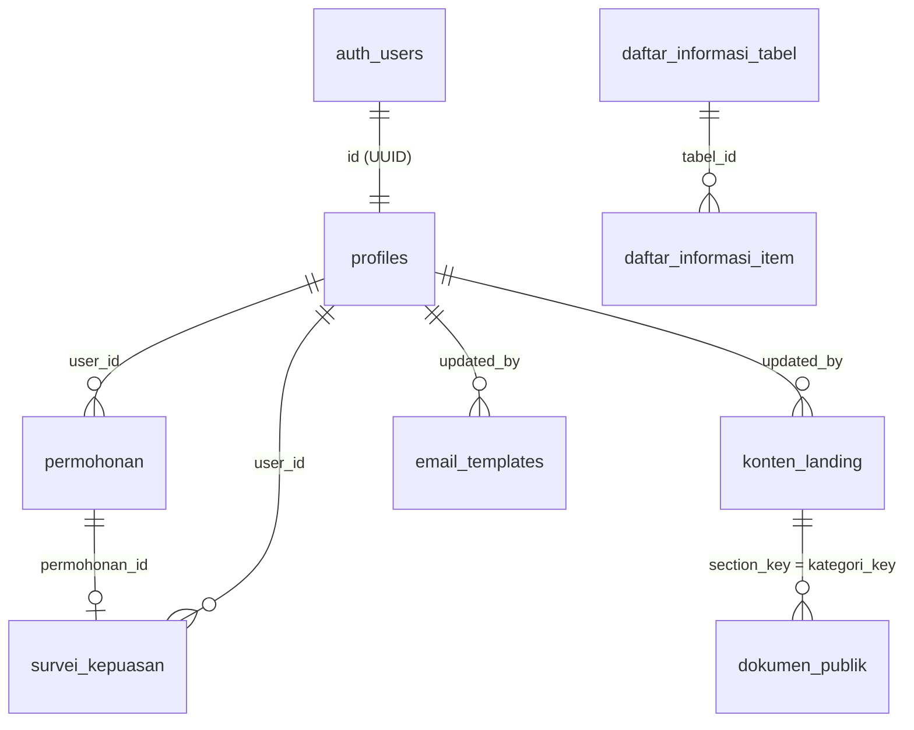

# PPID Digital - Dinas CIKASDA Provinsi Sulawesi Tengah

Portal Layanan Informasi dan Dokumentasi Publik Digital Pejabat Pengelola Informasi dan Dokumentasi (PPID) Pelaksana Dinas Cipta Karya dan Sumber Daya Air (CIKASDA) Provinsi Sulawesi Tengah.

Aplikasi web ini mengelola permohonan informasi publik secara daring, penerbitan tanggapan resmi, pemantauan batas waktu layanan (SLA), manajemen dokumen publik, serta evaluasi kepuasan masyarakat berdasarkan regulasi keterbukaan informasi publik.

---

## Daftar Isi

1. [Landasan Regulasi](#landasan-regulasi)
2. [Arsitektur dan Teknologi](#arsitektur-dan-teknologi)
3. [Fitur Sistem](#fitur-sistem)
   - [Portal Publik dan Pemohon](#portal-publik-dan-pemohon)
   - [Konsol Administrasi PPID](#konsol-administrasi-ppid)
4. [Alur Layanan dan Standar SLA](#alur-layanan-dan-standar-sla)
5. [Survei Kepuasan Masyarakat (IKM)](#survei-kepuasan-masyarakat-ikm)
6. [Sistem Notifikasi Email dan Template CMS](#sistem-notifikasi-email-dan-template-cms)
7. [Skema Basis Data dan Migrasi SQL](#skema-basis-data-dan-migrasi-sql)
8. [Struktur Direktori](#struktur-direktori)
9. [Variabel Lingkungan](#variabel-lingkungan)
10. [Instalasi dan Setup Lokal](#instalasi-dan-setup-lokal)
11. [Inisialisasi Akun Administrator](#inisialisasi-akun-administrator)
12. [Informasi Sekretariat](#informasi-sekretariat)

---

## Landasan Regulasi

Pengembangan sistem disesuaikan dengan ketentuan regulasi berikut:
* **Undang-Undang Nomor 14 Tahun 2008** tentang Keterbukaan Informasi Publik (UU KIP).
* **Peraturan Komisi Informasi Nomor 1 Tahun 2021** tentang Standar Layanan Informasi Publik.
* **Peraturan Menteri Pendayagunaan Aparatur Negara dan Reformasi Birokrasi Nomor 14 Tahun 2017** tentang Pedoman Penyusunan Survei Kepuasan Masyarakat Unit Penyelenggara Pelayanan Publik.

---

## Arsitektur dan Teknologi

| Komponen | Spesifikasi | Keterangan |
| :--- | :--- | :--- |
| Framework | Next.js 16.3.0 | Arsitektur App Router, Server Components, dan Server Actions |
| Runtime & UI Library | React 19.2.8 | Penanganan state transaksi dan transisi asynchronous |
| Bahasa Pemrograman | TypeScript 5 | Validasi tipe statis di seluruh lapisan aplikasi |
| Desain & Styling | Tailwind CSS v4 + PostCSS | Utility-first CSS dengan konfigurasi token tema dinas |
| Tipografi & Ikon | Plus Jakarta Sans, Phosphor Icons | `@phosphor-icons/react` |
| Basis Data & Auth | Supabase (PostgreSQL 15) | `@supabase/ssr` (autentikasi berbasis cookie, RLS, trigger) |
| Komunikasi Realtime | Supabase Realtime | WebSocket listener pada perubahan data tabel permohonan |
| Pengiriman Email | Nodemailer 10.0.10 | Transporter SMTP dengan penanganan fallback otomatis |
| Penampil Dokumen | Google Drive Embed Viewer | Pratinjau dokumen PDF publik di dalam iframe terenkapsulasi |

---

## Fitur Sistem

### Portal Publik dan Pemohon

1. **Beranda Institusional (`/`)**:
   * Hero banner interaktif dengan navigasi langsung pengajuan permohonan atau penelusuran dokumen.
   * Profil pengantar tugas dan fungsi PPID CIKASDA Sulteng (terintegrasi dengan data dinamis `konten_landing`).
   * Diagram alur permohonan informasi publik 4 tahap (`AlurPermohonanDiagram`).
   * Katalog 8 kartu kategori informasi (`KategoriCard`) dengan penghitung jumlah dokumen dinamis per kategori dari tabel `dokumen_publik`.
   * Informasi kontak sekretariat dinas, alamat kantor, dan navigasi tautan cepat pada footer.

2. **Katalog Informasi Publik (`/informasi/[kategori]`)**:
   * Menampilkan 8 kategori dokumen: `daftar_informasi_publik`, `surat_keputusan`, `visi_misi`, `sop_spm`, `pelayanan`, `penghargaan`, `permohonan_informasi`, dan `dokumen_program_kegiatan`.
   * Matriks tabel KIP dinamis periode 2022-2026 dengan pencarian cepat dan pemilahan per tahun pada kategori `daftar_informasi_publik`.
   * Komponen viewer dokumen PDF bawaan (`DokumenViewer.tsx`) terintegrasi pratinjau Google Drive pada kategori dokumen.
   * Rincian maklumat pelayanan, jam operasional kantor (Senin-Kamis 08:00-16:00 WITA, Jumat 08:00-16:30 WITA), dan penegasan biaya layanan (Rp 0 / Bebas Biaya) pada kategori `pelayanan`.

3. **Klasifikasi KIP Mandiri**:
   * Rute publik terpisah untuk informasi `/berkala`, `/serta-merta`, `/setiap-saat`, dan `/dikecualikan`.

4. **Autentikasi Pengguna**:
   * **Pendaftaran Akun (`/daftar`)**: Pendaftaran pemohon baru **wajib menggunakan akun Google resmi** (`signInWithOAuth`) guna verifikasi keabsahan alamat email pemohon secara terintegrasi.
   * **Login Akun (`/login`)**: Mendukung dua opsi masuk:
     1. **Masuk dengan Google**: Autentikasi instan melalui Google OAuth.
     2. **Form Login Konvensional**: Masuk menggunakan **Alamat Email** atau **Nomor Induk Kependudukan (NIK)** 16 digit beserta kata sandi.
   * **Pop-up Wajib Isi Data Diri**: Pemohon yang baru pertama kali mendaftar via Google otomatis disambut oleh modal **non-dismissable** di portal pemohon untuk melengkapi **NIK (16 digit)** dan **Nomor WhatsApp/Telepon** sesuai standar identitas pemohon UU KIP.
   * **Pop-up Opsi Atur / Ganti Kata Sandi**:
     - Ditampilkan langsung setelah pengisian data diri pemohon selesai.
     - Ditampilkan setiap kali pemohon masuk melalui Google OAuth (dapat ditutup / diabaikan jika tidak ingin mengganti kata sandi).
     - Berfungsi untuk menetapkan kata sandi lokal akun agar pemohon di kemudian hari dapat masuk melalui form login konvensional.
   * **Pemulihan Sandi (`/lupa-sandi` & `/update-sandi`)**: Permintaan token reset via email dan pembaruan password melalui callback endpoint `/api/auth/callback`.

5. **Portal Pemohon (`/permohonan-saya`)**:
   * **Formulir Pengajuan (`/permohonan-saya/ajukan`)**: Pemilihan kategori informasi, pengisian rincian permohonan, dan preferensi cara perolehan (*Melihat / Membaca / Mendengarkan*, *Salinan Elektronik (Softcopy / Digital)*, atau *Salinan Cetak (Hardcopy)*).
   * **Kalkulasi SLA Otomatis**: Menghitung tenggat waktu awal 10 hari kerja saat formulir dikirimkan.
   * **Pembaruan Status Realtime**: Komponen `PermohonanRealtimeListener` memperbarui status tiket seketika saat ada perubahan dari admin.
   * **Detail Permohonan (`/permohonan-saya/[id]`)**: Rincian status, tanggal pengajuan, tenggat waktu, jawaban tertulis admin beserta tautan dokumen, riwayat alasan jika masa layanan diperpanjang, serta pemberitahuan hak keberatan 30 hari kerja jika permohonan ditolak.
   * **Formulir Survei IKM**: Komponen penilaian kepuasan aktif secara otomatis pada halaman detail begitu tiket berstatus `dijawab`.

---

### Konsol Administrasi PPID

Akses konsol admin pada `/admin` diproteksi secara ganda melalui `middleware.ts`, `app/admin/layout.tsx`, dan Row Level Security (RLS) di PostgreSQL.

1. **Dashboard Manajemen Permohonan (`/admin`)**:
   * Metrik ringkasan jumlah permohonan: Total, Perlu Diproses (`diajukan`), Sedang Diproses (`diproses`), Selesai (`dijawab`), dan Ditolak (`ditolak`).
   * Filter tiket berdasarkan status dan pencarian data pemohon (nama, NIK, deskripsi).
   * Verifikasi berkas: Mengubah status menjadi `diproses`.
   * Penerbitan jawaban: Memasukkan surat tanggapan tertulis atau link dokumen Google Drive, mengubah status menjadi `dijawab`.
   * Perpanjangan masa layanan: Menambahkan waktu kerja **+7 hari kerja** disertai pengisian alasan tertulis.
   * Penolakan permohonan: Memasukkan alasan hukum/pengecualian penolakan informasi publik.
   * Rekapitulasi laporan: Modal cetak laporan format resmi dilengkapi kop surat dinas dan opsi ekspor data ke file Excel (`.xls`).

2. **CMS Matriks Daftar Informasi Publik (`/admin/daftar-informasi`)**:
   * Manajemen tabel tematik KIP periode tahun 2022 hingga 2026.
   * Konfigurasi judul tabel, deskripsi periode, tipe tombol aksi, dan pengelolaan baris data.
   * Kolom tautan dokumen per tahun tersimpan dalam format `JSONB`.
   * Tombol inisialisasi untuk sinkronisasi dataset default ke database.

3. **CMS Konten Halaman & Dokumen (`/admin/konten`)**:
   * Editor teks judul dan pengantar untuk setiap section beranda serta 8 kategori informasi publik.
   * Pengelolaan daftar berkas PDF pendukung (tambah, edit judul, ubah link Google Drive, hapus berkas).

4. **CMS Template Notifikasi Email (`/admin/email-templates`)**:
   * Pengaturan template notifikasi untuk 6 skenario alur kerja permohonan.
   * Kustomisasi subjek, heading, label badge, pesan pembuka, pesan penutup, dan tautan aksi.
   * Editor didukung fitur substitusi token dinamis (`{{id}}`, `{{nama}}`, `{{nik}}`, `{{deadline_awal}}`, `{{jawaban_admin}}`, dll.).
   * Mode pratinjau langsung (Live Preview) dengan simulasi data pada tampilan desktop dan mobile.
   * Fitur pengiriman uji coba (Test Send) ke alamat email admin yang sedang aktif.
   * Fitur reset template ke format bawaan dinas.

5. **Dashboard Analitik Survei IKM (`/admin/survei`)**:
   * Perhitungan agregasi Nilai Rata-Rata (NRR) dari 4 unsur penilaian.
   * Konversi nilai IKM ke skala 25 - 100 dan penentuan kategori Mutu Pelayanan (A / B / C / D).
   * Grafik sebaran skor kepuasan dan capaian rata-rata per aspek layanan.
   * Tabel masukan kualitatif (kritik dan saran pemohon) dengan filter bintang.
   * Opsi cetak laporan survei resmi dan ekspor data ke Excel (`.xls`).

---

## Alur Layanan dan Standar SLA

Pengelolaan waktu layanan permohonan mengacu pada Pasal 22 Undang-Undang Nomor 14 Tahun 2008:

```
[Pemohon Mengajukan] ───────> [Tiket Terdaftar] ───────> [Admin Verifikasi]
                               (SLA: 10 Hari Kerja)              │
                                                                 ├─> Status: DIPROSES
                                                                 │
                                                                 ├─> Opsi: PERPANJANG (+7 Hari Kerja)
                                                                 │   (Alasan tertulis dikirim ke pemohon)
                                                                 │
                                                                 ├─> Status: DIJAWAB
                                                                 │   (Jawaban & tautan dokumen diserahkan)
                                                                 │   └──> Pengisian Survei IKM
                                                                 │
                                                                 └─> Status: DITOLAK
                                                                     (Surat penolakan tertulis +
                                                                      Informasi hak keberatan 30 hari)
```

### Ketentuan Hari Kerja
* Perhitungan tenggat waktu hanya menghitung hari **Senin sampai Jumat**. Hari Sabtu dan Minggu tidak dihitung sebagai hari kerja.
* **Batas Waktu Awal (`deadline_awal`)**: Maksimal 10 hari kerja sejak permohonan berhasil dikirim.
* **Perpanjangan Waktu (`deadline_akhir`)**: Penambahan maksimal 7 hari kerja berikutnya jika materi informasi memerlukan penelaahan teknis lebih mendalam. Admin wajib menyertakan alasan tertulis sebelum masa 10 hari kerja pertama berakhir.
* **Masa Pengajuan Keberatan**: Pemohon berhak mengajukan keberatan administratif kepada Atasan PPID dalam tenggat 30 hari kerja setelah diterimanya surat penolakan atau tanggapan.

---

## Survei Kepuasan Masyarakat (IKM)

Sistem evaluasi mutu layanan mengacu pada **Peraturan Menteri PAN-RB Nomor 14 Tahun 2017**:

### 4 Unsur Penilaian (Skala 1 - 5)
1. **U1 - Kepuasan Umum**: Kepuasan menyeluruh terhadap pelayanan informasi publik Dinas CIKASDA.
2. **U2 - Kecepatan Layanan**: Kecepatan respons dan ketepatan penyelesaian berkas terhadap batas SLA.
3. **U3 - Kesesuaian Informasi**: Kesesuaian materi dokumen yang diberikan dengan rincian yang diminta.
4. **U4 - Kemudahan Prosedur**: Kemudahan prosedur pengajuan serta aksesibilitas antarmuka portal.

### Formula Perhitungan
1. **Nilai Rata-Rata (NRR)**:
   $$\text{NRR} = \frac{U_1 + U_2 + U_3 + U_4}{4}$$
2. **Nilai IKM Konversi**:
   $$\text{IKM Konversi} = \text{NRR} \times 20$$

### Skala Mutu Pelayanan

| Rentang Nilai Konversi | Mutu Pelayanan | Kinerja Pelayanan |
| :---: | :---: | :---: |
| 88.31 - 100.00 | **A** | Sangat Baik |
| 76.61 - 88.30 | **B** | Baik |
| 65.00 - 76.60 | **C** | Kurang Baik |
| 25.00 - 64.99 | **D** | Tidak Baik |

Setiap tiket permohonan hanya dapat dinilai 1 kali oleh pemohon yang bersangkutan (`permohonan_id UNIQUE`).

---

## Sistem Notifikasi Email dan Template CMS

Sistem mengirimkan notifikasi email otomatis melalui Nodemailer untuk menjaga transparansi alur permohonan.

### Daftar Template Resmi

| Kode Template (`template_key`) | Penerima | Kondisi Pengiriman |
| :--- | :--- | :--- |
| `pengajuan_baru_admin` | Petugas / Admin | Ada permohonan informasi publik baru yang diajukan masyarakat |
| `pengajuan_baru_pemohon` | Pemohon | Tanda terima sah permohonan beserta nomor registrasi tiket |
| `status_diproses` | Pemohon | Admin mengubah status tiket menjadi "Diproses" |
| `jawaban_admin` | Pemohon | Admin mengirimkan tanggapan resmi dan tautan berkas |
| `perpanjangan_sla` | Pemohon | Admin memperpanjang waktu penanganan (+7 hari kerja) dengan alasan |
| `penolakan` | Pemohon | Admin menolak permohonan beserta alasan hukum dan hak keberatan |

### Daftar Variabel Dinamis (Tokens)
* `{{id}}`: ID registrasi tiket permohonan.
* `{{nama}}`: Nama lengkap pemohon.
* `{{nik}}`: NIK pemohon.
* `{{email}}`: Alamat email pemohon.
* `{{telepon}}`: Nomor telepon/WhatsApp pemohon.
* `{{jenis_informasi}}`: Kategori klasifikasi informasi yang diminta.
* `{{deskripsi}}`: Rincian informasi yang diajukan pemohon.
* `{{cara_memperoleh}}`: Bentuk salinan yang dipilih.
* `{{tanggal}}`: Tanggal masuk pengajuan berkas.
* `{{deadline_awal}}`: Estimasi batas waktu layanan 10 hari kerja.
* `{{deadline_akhir}}`: Batas waktu akhir setelah perpanjangan SLA.
* `{{jawaban_admin}}`: Isi teks keputusan atau link dokumen dari petugas.
* `{{alasan}}`: Alasan penolakan atau perpanjangan waktu.
* `{{link_portal}}`: Tautan langsung menuju halaman rincian tiket pemohon atau konsol admin.

### Penanganan Fallback (Mock Mode)
Jika variabel lingkungan `SMTP_PASS` bernilai kosong atau belum disetel, pengiriman email secara otomatis dialihkan ke mode simulasi (mock logger). Sistem tetap memproses permohonan tanpa menimbulkan error fatal pada aplikasi.

---

## Skema Basis Data dan Migrasi SQL

Struktur database tersimpan pada direktori `supabase/migrations/`:

```
supabase/migrations/
├── 0001_init.sql                            # Profiles, Permohonan, Konten Landing, Dokumen Publik, RLS, Trigger
├── 0002_daftar_informasi_publik.sql         # Matriks Tabel & Item Daftar Informasi Publik 2022-2026
├── 0003_email_templates.sql                 # CMS Template Notifikasi Email & Seeding Default
├── 0004_survei_kepuasan.sql                 # Tabel Penilaian Survei IKM PermenPAN-RB No. 14/2017
└── 0005_auth_google_and_profile_helpers.sql # Fungsi get_email_by_nik (security definer) untuk login form NIK
```

### Relasi Antar Tabel



### Ringkasan Entitas
1. **`public.profiles`**: Menyimpan metadata profil pengguna (`id`, `nama`, `nik`, `email`, `telepon`, `role`). Terikat langsung ke `auth.users(id)` secara cascade. Menggunakan fungsi pembantu `public.is_admin()` dengan flag `SECURITY DEFINER` untuk mengevaluasi hak akses admin tanpa menimbulkan rekursi tak hingga pada RLS.
2. **`public.permohonan`**: Menyimpan transaksi tiket informasi (`id`, `user_id`, `jenis_informasi`, `deskripsi`, `cara_memperoleh`, `status`, `jawaban_admin`, `deadline_awal`, `diperpanjang`, `alasan_perpanjangan`, `deadline_akhir`).
3. **`public.konten_landing` & `public.dokumen_publik`**: Menyimpan deskripsi halaman kategori dan daftar tautan berkas dokumen Google Drive.
4. **`public.daftar_informasi_tabel` & `public.daftar_informasi_item`**: Menyimpan struktur matriks tabel KIP 2022-2026. Tautan dokumen tiap tahun disimpan dalam kolom `links` berformat `JSONB`.
5. **`public.email_templates`**: Menyimpan susunan redaksi 6 template email dinamis.
6. **`public.survei_kepuasan`**: Menyimpan skor U1-U4 dan kritik/saran dari pemohon. Memiliki konstrain `UNIQUE(permohonan_id)`.

---

## Struktur Direktori

```
PPID-Digital/
├── app/
│   ├── (public)/                       # Halaman statis klasifikasi KIP
│   │   ├── berkala/page.tsx
│   │   ├── dikecualikan/page.tsx
│   │   ├── serta-merta/page.tsx
│   │   └── setiap-saat/page.tsx
│   ├── actions/                        # Server Actions Next.js
│   │   ├── admin.ts                    # Mutasi tiket permohonan & CMS konten
│   │   ├── auth-profile.ts             # Mutasi profil pemohon (NIK/WA) & resolver NIK-email
│   │   ├── daftar-informasi.ts         # Mutasi data matriks KIP 2022-2026
│   │   ├── email-templates.ts          # Mutasi template email & test send
│   │   ├── email.ts                    # Logika pengiriman email notifikasi
│   │   └── survei.ts                   # Mutasi survei IKM & rekapitulasi nilai
│   ├── admin/                          # Rute Konsol Administrasi Petugas
│   │   ├── daftar-informasi/page.tsx   # CMS Matriks Tabel KIP
│   │   ├── email-templates/page.tsx    # CMS Visual Editor Template Email
│   │   ├── konten/page.tsx             # CMS Konten Kategori & Berkas Dokumen
│   │   ├── survei/page.tsx             # Dashboard Analitik IKM & Rekapitulasi
│   │   ├── layout.tsx                  # Proteksi role admin & sidebar layout
│   │   └── page.tsx                    # Manajemen data permohonan masuk
│   ├── api/
│   │   └── auth/callback/route.ts      # Auth handler untuk Google OAuth & reset sandi
│   ├── daftar/page.tsx                 # Registrasi pemohon (Google OAuth)
│   ├── informasi/
│   │   ├── [kategori]/
│   │   │   ├── DokumenViewer.tsx       # Embedded PDF viewer Google Drive
│   │   │   └── page.tsx                # Halaman dinamis 8 kategori KIP
│   │   └── data/
│   │       └── daftarInformasiDefault.ts # Dataset matriks KIP bawaan 2022-2026
│   ├── lib/
│   │   ├── email/                      # Engine email Nodemailer
│   │   │   ├── custom_templates.json   # Fallback local storage template
│   │   │   ├── default-templates.ts    # Template bawaan resmi
│   │   │   ├── mailer.ts               # Transporter SMTP & mock handler
│   │   │   ├── template-engine.ts      # Parser variabel dinamis & HTML builder
│   │   │   ├── template-store.ts       # Penyimpanan template (Supabase DB / local JSON)
│   │   │   └── templates.ts            # Layout HTML email resmi
│   │   └── supabase/                   # Klien Supabase
│   │       ├── client.ts               # Browser client (@supabase/ssr)
│   │       └── server.ts               # Server client dengan manajemen cookie
│   ├── login/page.tsx                  # Form login (Google OAuth atau Email/NIK + Sandi)
│   ├── lupa-sandi/page.tsx             # Pengajuan reset kata sandi
│   ├── permohonan-saya/                # Portal layanan pemohon
│   │   ├── [id]/loading.tsx            # Skeleton loader detail permohonan
│   │   ├── [id]/page.tsx               # Rincian tiket, jawaban resmi, form survei IKM
│   │   ├── ajukan/page.tsx             # Form pengajuan permohonan informasi
│   │   ├── layout.tsx                  # Wrapper proteksi sesi & modal kelengkapan data diri
│   │   ├── loading.tsx                 # Skeleton loader riwayat permohonan
│   │   └── page.tsx                    # Daftar riwayat tiket pemohon
│   ├── update-sandi/page.tsx           # Form input kata sandi baru
│   ├── error.tsx                       # Global error boundary (page level)
│   ├── global-error.tsx                # Root layout error boundary
│   ├── globals.css                     # Konfigurasi Tailwind CSS v4
│   ├── layout.tsx                      # Root layout, metadata institusi, font
│   ├── not-found.tsx                   # Halaman 404 dinas
│   └── page.tsx                        # Beranda institusi PPID CIKASDA
├── components/                         # Komponen antarmuka pengguna
│   ├── admin/
│   │   ├── AdminHeader.tsx             # Header konsol admin, pencarian, dan filter
│   │   ├── AdminPermohonanModals.tsx   # Modal aksi: proses, jawab, tolak, perpanjang
│   │   └── AdminPermohonanTable.tsx    # Tabel daftar tiket admin
│   ├── auth/
│   │   ├── AuthModalsWrapper.tsx       # Orkestrator modal data diri & password
│   │   ├── OpsiPasswordModal.tsx       # Modal opsi set/ganti kata sandi akun
│   │   └── WajibIsiDataDiriModal.tsx   # Modal wajib kelengkapan NIK & nomor WA
│   ├── AdminBreadcrumb.tsx             # Penunjuk navigasi hierarki admin
│   ├── AdminLogoutButton.tsx           # Tombol keluar akun admin
│   ├── AdminNav.tsx                    # Tab navigasi konsol admin
│   ├── AdminSidebar.tsx                # Sidebar navigasi admin responsif
│   ├── AlurPermohonanDiagram.tsx       # Diagram visual tahapan alur permohonan
│   ├── ConfirmModal.tsx                # Dialog konfirmasi aksi penting
│   ├── DaftarInformasiPublikView.tsx   # Tabel interaktif matriks KIP publik
│   ├── KategoriCard.tsx                # Kartu kategori di beranda
│   ├── LandingNav.tsx                  # Navbar beranda publik responsif
│   ├── LaporanModal.tsx                # Modal cetak & ekspor laporan permohonan
│   ├── Modal.tsx                       # Base modal dialog
│   ├── PermohonanRealtimeListener.tsx  # Listener WebSocket Supabase Realtime
│   ├── SkeletonCard.tsx                # Placeholder pemuatan kartu
│   ├── SurveiKepuasanCard.tsx          # Kartu evaluasi survei kepuasan IKM
│   └── Toast.tsx                       # Notifikasi pop-up feedback
├── public/                             # Berkas statis
│   ├── hero-bg.jpeg                    # Gambar latar section hero
│   ├── logo-cikasda.webp               # Logo resmi Dinas CIKASDA Sulteng
│   └── logo-sulteng.webp               # Logo Pemerintah Provinsi Sulawesi Tengah
├── supabase/
│   ├── config.toml                     # Konfigurasi lokal Supabase CLI
│   └── migrations/                     # Berkas migrasi database PostgreSQL
├── middleware.ts                       # Proteksi rute /admin dan /permohonan-saya
├── next.config.ts                      # Konfigurasi Next.js
├── package.json                        # Definisi dependensi dan skrip proyek
└── tsconfig.json                       # Konfigurasi TypeScript
```

---

## Variabel Lingkungan

Buat berkas `.env.local` pada direktori root proyek dengan konfigurasi parameter berikut:

```env
# Supabase Configuration
# Didapatkan melalui Supabase Dashboard -> Project Settings -> API
NEXT_PUBLIC_SUPABASE_URL=https://your-project-id.supabase.co
NEXT_PUBLIC_SUPABASE_ANON_KEY=your-supabase-anon-key

# Application URL
# Digunakan untuk resolusi tautan pada notifikasi email dan callback auth
NEXT_PUBLIC_APP_URL=http://localhost:3000

# Konfigurasi SMTP Nodemailer
ADMIN_NOTIFICATION_EMAIL=sipardig2026@gmail.com
SMTP_HOST=smtp.gmail.com
SMTP_PORT=465
SMTP_SECURE=true
SMTP_USER=sipardig2026@gmail.com
# Gunakan Google Workspace / Gmail App Password (16 karakter tanpa spasi)
SMTP_PASS=your-16-char-app-password
SMTP_FROM="PPID Digital CIKASDA Sulteng" <sipardig2026@gmail.com>
```

> Catatan: Jika `SMTP_PASS` dikosongkan, aplikasi beralih ke mode simulasi (mock transporter) dan mencatat notifikasi email ke konsol server tanpa menghentikan proses pengajuan tiket.

---

## Instalasi dan Setup Lokal

### 1. Prasyarat Sistem
* Node.js versi 20.x atau lebih baru.
* Pengelola paket: `npm` atau `pnpm`.
* Proyek PostgreSQL aktif di Supabase.

### 2. Kloning Repositori
```bash
git clone https://github.com/Giovano1106/PPID-Digital.git
cd PPID-Digital
```

### 3. Instal Dependensi
```bash
npm install
# atau
pnpm install
```

### 4. Eksekusi Migrasi Basis Data
Buka **SQL Editor** pada Supabase Dashboard, lalu jalankan seluruh skrip migrasi secara berurutan:
1. `supabase/migrations/0001_init.sql`
2. `supabase/migrations/0002_daftar_informasi_publik.sql`
3. `supabase/migrations/0003_email_templates.sql`
4. `supabase/migrations/0004_survei_kepuasan.sql`
5. `supabase/migrations/0005_auth_google_and_profile_helpers.sql`

### 5. Konfigurasi Google OAuth (Supabase & Google Cloud)
1. Buka **[Google Cloud Console](https://console.cloud.google.com/)** -> **APIs & Services** -> **Credentials**.
2. Buat atau pilih **OAuth 2.0 Client ID** (Tipe: *Web application*).
3. Pada bagian **Authorized redirect URIs**, tambahkan URL callback Supabase Anda:
   ```text
   https://<your-project-id>.supabase.co/auth/v1/callback
   ```
4. Salin **Client ID** dan **Client Secret**.
5. Buka **Supabase Dashboard** -> **Authentication** -> **Providers** -> **Google**.
6. Aktifkan sakelar **Enable Google provider**, lalu tempelkan Client ID dan Client Secret, kemudian klik **Save**.

### 6. Konfigurasi Lingkungan
Salin berkas template lingkungan ke `.env.local` dan sesuaikan nilainya dengan kredensial proyek Supabase Anda:
```bash
cp .env.example .env.local
```

### 7. Menjalankan Server Pengembangan
```bash
npm run dev
# atau
pnpm dev
```

Aplikasi dapat diakses melalui peramban pada alamat `http://localhost:3000`.

---

## Inisialisasi Akun Administrator

Akun administrator dibuat dengan mengubah role pengguna secara langsung pada database:

1. Masuk ke aplikasi melalui halaman `http://localhost:3000/login` atau lakukan pendaftaran via Google di `http://localhost:3000/daftar`.
2. Buka **Supabase Dashboard** -> **Table Editor** -> pilih tabel `public.profiles`.
3. Temukan baris data pengguna yang ingin dijadikan admin, lalu ubah nilai kolom `role` dari `'pemohon'` menjadi `'admin'`.
4. Muat ulang halaman aplikasi.
5. Sistem secara otomatis mendeteksi role `'admin'` dan mengarahkan ke konsol administrasi pada `http://localhost:3000/admin`.

---

## Informasi Sekretariat

**Dinas Cipta Karya dan Sumber Daya Air Provinsi Sulawesi Tengah**
* Alamat: Jl. Mohammad Yamin No.11, Tatura Utara, Kec. Palu Selatan, Kota Palu, Sulawesi Tengah 94111
* Telepon / WhatsApp: 0812-4217-0628
* Email Resmi: `cikasda.sulteng@gmail.com` / `sipardig2026@gmail.com`
* Website Resmi: [cikasda.sultengprov.go.id](https://cikasda.sultengprov.go.id)
